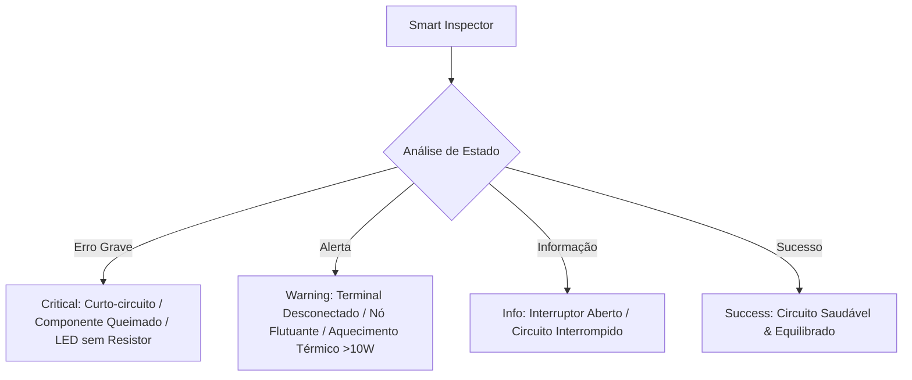

# Documentação Técnica e Educacional da Bancada Online (Bancada Livre)

O **EletroLab** possui uma **Bancada Online / Bancada Livre** (*Sandbox Mode*), um laboratório virtual interativo de simulação de circuitos elétricos projetado para proporcionar uma experiência de aprendizado gamificada, intuitiva e rigorosa sob o ponto de vista da física.

---

## 1. Visão Geral e Objetivos Educacionais

A Bancada Online permite aos estudantes e entusiastas montar, testar e analisar circuitos elétricos sem restrições de layout pré-definido. Os objetivos centrais incluem:

* **Experimentação Livre e Segura:** Explorar conceitos da Lei de Ohm, leis de Kirchhoff e potência elétrica sem riscos de danos a equipamentos reais.
* **Dualidade Visual Físico vs. Esquemático:** Alternar instantaneamente entre a visualização realista 3D dos componentes e a simbologia técnica padronizada (NBR/IEEE).
* **Feedback Educativo Dinâmico:** Integrar a simulação física a respostas visuais imediatas (queima de LED/lâmpada, aquecimento térmico, curtos-circuitos) e orientações personalizadas do mascote **Professor Volts**.
* **Medição com Instrumentos Virtuais:** Utilizar um multímetro digital funcional e um osciloscópio HUD para medições diretas de tensão, corrente e resistência.

---

## 2. Arquitetura de Software e Gerenciamento de Estado

A Bancada Online é construída utilizando **Flutter** com o ecossistema **Riverpod** para gerenciamento de estado previsível e reativo.

```
┌──────────────────────────────────────────────────────────────────────────┐
│                            SandboxScreen                                 │
│      (Grid Canvas, Floating Widgets, Keyboard Shortcuts, Toolbars)       │
└────────────────────────────────────┬─────────────────────────────────────┘
                                     │ watch / read
                                     ▼
┌──────────────────────────────────────────────────────────────────────────┐
│                       sandboxControllerProvider                          │
│                         (SandboxController)                              │
├──────────────────────────────────────────────────────────────────────────┤
│  - Undo/Redo Stacks (Histórico de 30 estados)                            │
│  - Persistência Local via SharedPreferences                              │
│  - Solver de Simulação de Circuito (Graph Traversal & Physical Rules)   │
└────────────────────────────────────┬─────────────────────────────────────┘
                                     │ imutável
                                     ▼
┌──────────────────────────────────────────────────────────────────────────┐
│                             SandboxState                                 │
├────────────────────────────────────────────────────────────────────────## 
│  - components : List<SandboxComponent>                                   │
│  - wires : List<SandboxWire>                                             │
│  - isSimulating : bool                                                   │
│  - simulationValues : Map<String, double>                                │
│  - burnedComponentIds : Set<String>                                      │
│  - errorMessage : String?                                                │
└──────────────────────────────────────────────────────────────────────────┘
```

### 2.1. Controle de Histórico (Undo / Redo)
* Mantém duas pilhas de snapshots (`_undoStack` e `_redoStack`) com profundidade limite de **30 ações**.
* Cada adição, movimentação, rotação, conexão de fio ou alteração de parâmetro gera um snapshot preservado para reversão instantânea via atalhos `Ctrl+Z` / `Ctrl+Y`.

### 2.2. Persistência de Dados Local
* O estado da bancada é automaticamente serializado em JSON e salvo no `SharedPreferences` sob as chaves:
  * `sandbox_components`: Lista serializada de componentes posicionados.
  * `sandbox_wires`: Conexões efetuadas entre terminais.
  * `sandbox_is_simulating`: Estado de execução do motor de simulação.

---

## 3. Motor de Simulação Elétrica & Solver de Grafo

O cálculo elétrico ocorre em tempo real no método `_calculateSimulationForState` do `SandboxController`.

### 3.1. Algoritmo de Travessia e Fechamento de Malhas
1. **Identificação da Fonte:** O solver localiza as fontes de energia (Baterias ou Fontes Reguláveis). Se nenhuma fonte for encontrada, o circuito permanece inativo.
2. **Grafo de Caminhamento (`_traverseForState`):** A partir do polo positivo (terminal `B`), o algoritmo percorre os fios e componentes conectados procurando fechar o caminho de volta até o polo negativo (terminal `A`).
3. **Resistência Equivalente da Malha ($R_{eq}$):** É calculada a soma das resistências dos componentes presentes na malha fechada:
   $$R_{eq} = \sum R_{componentes}$$
4. **Corrente Total da Malha ($I$):** Pela Lei de Ohm:
   $$I = \frac{V_{fonte}}{R_{eq}}$$
5. **Queda de Tensão ($V_{drop}$) e Potência ($P$):** Para cada componente no caminho:
   $$V_{drop} = I \times R_{comp}$$
   $$P = V_{drop} \times I$$
6. **Potencial dos Nós:** O potencial em cada terminal ($A$ e $B$) é mapeado individualmente (`node_voltage_COMP_A` e `node_voltage_COMP_B`), permitindo a medição precisa por ponteiras de multímetro.

### 3.2. Regras Físicas de Sobrecarga e Queima Educativa

| Componente | Condição de Queima / Sobrecarga | Consequência no Simulador | Alerta Educativo |
|---|---|---|---|
| **Circuito Geral** | $R_{eq} \le 0.1\,\Omega$ | Disparo de alerta de curto-circuito | *"CURTO-CIRCUITO DETECTADO! Conexão direta entre pólos sem carga!"* |
| **LED** | $I > 50\,\text{mA}$ ou $V_{drop} > 3.3\,\text{V}$ | Componente entra em `burnedComponentIds` | *"O LED QUEIMOU! Excedeu o limite seguro (50mA). Conecte um resistor em série!"* |
| **Lâmpada** | $P > 15.0\,\text{W}$ | Rompimento do filamento | *"FILAMENTO ROMPIDO! A lâmpada queimou por excesso de potência!"* |
| **Motor CC** | $V_{drop} > 18.0\,\text{V}$ | Danificação da bobina | *"BOBINA QUEIMADA! O motor sofreu sobretensão!"* |
| **Fusível** | $I > I_{máx}$ (ex: $2.0\,\text{A}$) | Fusível abre o circuito | *"FUSÍVEL QUEIMOU! Corrente excedeu o limite, desarmando o circuito!"* |

> **Nota:** Componentes queimados funcionam como circuito aberto, interrompendo o fluxo elétrico até que o usuário utilize a função de substituição/reparo. Ao queimar um componente, o simulador dispara uma animação vetorial contínua de **fumaça subindo (Smoke Puffs)**, **incandescência no ponto de ruptura** e **fagulhas/faíscas saltitantes (Embers Sparks)**, oferecendo feedback visual dinâmico em tempo real tanto no modo Físico 3D quanto no modo Esquemático.

---

## 4. Catálogo de Componentes Disponíveis

| Componente | Tipo Enum | Parâmetros Editáveis | Descrição Educacional |
|---|---|---|---|
| **Bateria DC** | `battery` | Tensão ($1.5\,\text{V}$ a $24\,\text{V}$) | Fonte de tensão contínua padrão. |
| **Fonte Regulável** | `powerSupply` | Tensão ($0\,\text{V}$ a $30\,\text{V}$) | Fonte de bancada de laboratório ajustável em tempo real. |
| **Interruptor** | `switchComponent` | Estado (Aberto / Fechado) | Chave mecânica para controle de fluxo elétrico. |
| **Lâmpada** | `bulb` | Resistência ($1\,\Omega$ a $100\,\Omega$) | Carga resistiva incandescente que brilha proporcionalmente à potência. |
| **Resistor** | `resistor` | Resistência ($1\,\Omega$ a $10\,\text{k}\Omega$) | Resistor de filme de carbono com faixas de cores dinâmicas. |
| **Potenciômetro** | `potentiometer` | Resistência Variável | Resistor ajustável via slider interativo. |
| **Motor CC** | `motor` | Tensão nominal ($3\,\text{V}$ a $18\,\text{V}$) | Converter energia elétrica em rotação mecânica visual. |
| **LED** | `led` | Polaridade Direta | Diodo emissor de luz com sensibilidade a sobrecorrente. |
| **Diodo** | `diode` | Polarização Direta ($A \rightarrow B$) | Permite a passagem de corrente em um único sentido. |
| **Fusível** | `fuse` | Corrente limite ($0.5\,\text{A}$ a $10\,\text{A}$) | Dispositivo de proteção contra sobrecorrente. |
| **Capacitor** | `capacitor` | Capacitância ($\mu\text{F}$) | Componente para armazenamento de carga. |
| **Buzzer** | `buzzer` | Tensão de operação | Emissor sonoro para alarmes de circuito. |

---

## 5. Modos de Renderização Visual e Interface

A bancada possui suporte nativo a dois modos visuais alternáveis em tempo real através do botão na barra superior (`ModeToggleSwitch`):

### 5.1. Modo Físico Realista (3D Custom Canvas)
* Renderizado via `ComponentPhysicalPainter`.
* Desenho detalhado com gradientes metálicos, sombras projetadas e componentes realistas (baterias com pólos, capacitores eletrolíticos, potenciômetros recartilhados).
* Fios desenhados com volume 3D, destaques especulares brancos e curvatura catenária simulando gravidade.

### 5.2. Modo Esquemático (Engenharia NBR / IEEE)
* Renderizado via `CircuitSymbolPainter`.
* Desenho técnico vetorial com símbolos esquemáticos padrão para cada componente.
* Fios com **Roteamento Ortogonal Inteligente (Manhattan Routing)**, curvas com raio de curvatura suave e pontos de junção em "T" ($T$-Junction Dots) indicando conexões elétricas múltiplas.

---

## 6. Sistema de Fiação e Animação de Elétrons

### 6.1. Atração Magnética (Magnetic Snap)
* Quando o usuário arrasta um fio a partir de um terminal, o sistema ativa um raio de atração magnética de **60px**.
* O terminal de destino mais próximo atrai a ponta do fio e acende uma auréola neon brilhante para garantir conexões sem falhas de alinhamento.

### 6.2. Animação de Partículas de Elétrons
* Quando o circuito está energizado e a simulação ativa, o `WiresPainter` calcula a métrica do caminho do fio (`PathMetrics`).
* Partículas luminosas percorrem as linhas dos fios em velocidade síncrona com o valor da corrente elétrica, proporcionando visualização direta da corrente contínua.

---

## 7. Instrumentos Virtuais de Medição

### 7.1. Cyber-Multímetro Digital 9000 (`SandboxMultimeterWidget`)
Um multímetro flutuante estilo Cyberpunk integrado à bancada:
* **Escalas de Medição:**
  * `V DC`: Mede a diferença de potencial elétrico ($\Delta V = V_{vermelha} - V_{preta}$) nos nós conectados.
  * `mA / A`: Mede a corrente elétrica que atravessa o componente selecionado (com seleção automática de faixa milliampère/ampère).
  * `Ω OHM`: Mede a resistência ôhmica individual do componente sob teste.
  * `OFF`: Desliga o visor e economiza processamento.
* **Ponteiras virtuais (Probes):** Ponta vermelha ($+$) e preta ($-$) aplicáveis em qualquer terminal do grid.
* **Funções Adicionais:** Botão `HOLD` para congelar leituras e `Reset Probes` para liberar as ponteiras.

### 7.2. Osciloscópio HUD (`SandboxOscilloscopeWidget`)
* Exibe a forma de onda da tensão e corrente do componente selecionado em tempo real, permitindo aos alunos visualizar a estabilidade do sinal DC.

---

## 8. Inspetor Inteligente & Diagnóstico Automático (Smart Inspector)

A classe `SandboxSmartInspector` realiza uma varredura contínua no estado da bancada e categoriza problemas em 4 níveis de severidade:



O diagnóstico completo pode ser aberto no diálogo **Inspetor do Circuito** (`SandboxInspectorDialog`), oferecendo recomendações práticas para correção de falhas.

---

## 9. Assistente Flutuante Mascot HUD (Professor Volts)

O mascote **Professor Volts** acompanha o usuário no canto inferior direito da tela (`SandboxMascotPanelWidget`):
* **Expressões Dinâmicas:**
  * `Neutral`: Orientações de montagem inicial.
  * `Happy`: Malha fechada com sucesso e simulação estável.
  * `Sad / Concerned`: Erro de sobrecarga, LED queimado ou curto-circuito.
* **Ações Rápidas Integradas:** Exibe botão direto de *"Substituir Todos Queimados"* quando componentes danificados são detectados.

---

## 10. Recursos de Produtividade, Presets e Atalhos

### 10.1. Exemplos Pré-carregados (Presets & Desafios Prontos)
Acessíveis no diálogo de *Desafios de Diagnóstico*:
1. **Desafio 1: O LED Misterioso:** Bateria 9V + LED + Interruptor (demonstração de proteção com resistor).
2. **Desafio 2: Proteção de Fusível:** Fonte Regulável 24V + Potenciômetro 1Ω + Fusível 2A + Motor CC.
3. **Desafio 3: O Curto Misterioso:** Bateria 9V + Lâmpada 5Ω com fio em curto-circuito.
4. **Desafio 4: Alarme Sonoro & Diodo:** Bateria 9V + Interruptor + Diodo Invertido + Buzzer (aprendizado sobre polaridade do diodo).
5. **Desafio 5: Estabilizador com Capacitor:** Fonte Regulável 12V + Resistor 100Ω + Capacitor 100µF + Lâmpada 20Ω (análise de filtragem e queda de tensão).
6. **Desafio 6: Controle de Velocidade do Motor:** Bateria 12V + Potenciômetro 50Ω + Motor CC 12V + Fusível 1.5A (controle reostático sem romper a proteção).

### 10.2. Seleção Múltipla e Operações em Lote (Marquee Box Selection)
A bancada suporta seleção de múltiplos componentes de forma ágil e intuitiva:
* **Seleção por Caixa (*Marquee Drag Selection*):** Clique e arraste o ponteiro do mouse em qualquer área vazia do grid para desenhar um retângulo de seleção estilizado (Cyber HUD). Todos os componentes interceptados pela caixa são selecionados simultaneamente.
* **Seleção por Clique Combinado (*Shift / Ctrl Click*):** Mantenha pressionada a tecla `Shift` ou `Ctrl` e clique nos componentes desejados para alternar individualmente sua inclusão na seleção.
* **Barra Flutuante de Ações Múltiplas (*Multi-Selection HUD*):** Ao selecionar mais de um componente, uma barra flutuante exibe o contador total de componentes selecionados e botões para **Rotacionar Todos**, **Excluir Todos** e **Desmarcar**.
* **Movimentação em Lote:** Arrastar qualquer componente pertencente a um grupo selecionado (ou usar as setas do teclado) move todos os componentes mantendo seus arranjos relativos.
* **Exclusão / Rotação em Lote:** Operações efetuadas via teclado ou HUD operam sobre todos os componentes selecionados simultaneamente, com suporte a desfazer/refazer (*Undo/Redo*) em um único snapshot de histórico.

### 10.3. Atalhos de Teclado Suportados

| Atalho | Ação Executada |
|---|---|
| `Delete` / `Backspace` | Remove todos os componentes selecionados e seus fios conectados |
| `R` | Rotaciona todos os componentes selecionados em 90° |
| `Setas (↑ ↓ ← →)` | Move os componentes selecionados no grid de célula em célula |
| `Esc` | Desmarca todos os componentes selecionados |
| `Espaço` | Alterna o estado do interruptor selecionado (Aberto/Fechado) |
| `Ctrl + Z` / `Cmd + Z` | Desfaz a última ação (Undo) |
| `Ctrl + Y` / `Cmd + Y` | Refaz a última ação desfeita (Redo) |

### 10.4. Relatório Técnico de Exportação (`SandboxExportDialog`)
Permite gerar um resumo dos dados técnicos do circuito (lista de componentes, conexões, medições e diagnósticos) para auditoria e estudos.

---

## 11. Estrutura de Arquivos da Bancada

```
lib/screens/sandbox/
├── models/
│   └── connection_source.dart         # Modelo de terminal de origem para conexões
├── utils/
│   └── sandbox_smart_inspector.dart    # Motor de diagnóstico e inspeção de circuito
├── widgets/
│   ├── sandbox_challenges_dialog.dart # Diálogo de desafios práticos na bancada
│   ├── sandbox_control_bar.dart        # Barra inferior de ferramentas e controles de simulação
│   ├── sandbox_export_dialog.dart     # Diálogo de exportação de relatórios
│   ├── sandbox_grid_painters.dart      # CustomPainters do Grid, Fios 3D/Ortogonais e Elétrons
│   ├── sandbox_inspector_dialog.dart   # Diálogo de inspeção de saúde do circuito
│   ├── sandbox_mascot_panel.dart       # Card flutuante do Professor Volts
│   ├── sandbox_metrics_panel.dart     # Painel de métricas do componente selecionado
│   ├── sandbox_multimeter.dart        # Instrumento Cyber-Multímetro Digital 9000
│   ├── sandbox_oscilloscope.dart      # Instrumento Osciloscópio HUD
│   ├── sandbox_quick_hud.dart         # Toolbar flutuante sobre componente selecionado
│   └── sandbox_toolbox.dart           # Paleta Drag & Drop de componentes
└── sandbox_screen.dart                 # Tela principal da Bancada Livre
```
