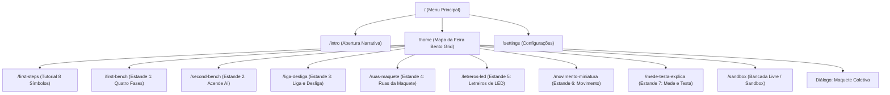

# UX, Telas e Fluxos de Navegação — EletroLab

Este documento detalha o mapa de rotas, as interfaces de usuário, o ciclo de interação do estudante em cada missão e os padrões visuais aplicados no EletroLab.

---

## 🗺️ 1. Mapa de Rotas e Navegação

A navegação no EletroLab é gerenciada de forma centralizada em [`lib/app/routes.dart`](file:///home/amanda/flutter_electric_circuit_game/lib/app/routes.dart) através de rotas nomeadas:



### Tabela de Rotas Oficiais

| Rota | Identificador | Tela de Destino | Descrição |
|---|---|---|---|
| `/` | `Routes.menu` | `MainMenuScreen` | Ponto de entrada com logo animado, opções rápidas e créditos. |
| `/intro` | `Routes.intro` | `IntroScreen` | Abertura com o ginásio da escola e a introdução da personagem Nuri e Prof. Volts. |
| `/home` | `Routes.home` | `HomeScreen` | Mapa interativo estilo Bento Grid com os estandes e a Maquete Coletiva. |
| `/first-steps` | `Routes.firstSteps` | `FirstStepsScreen` | Guia com 8 símbolos elétricos e quiz de fixação de fixação. |
| `/first-bench` | `Routes.firstBench` | `FirstBenchFlowScreen` | Jornada do Estande 1 em 4 fases guiadas (Conhecer, Inspecionar, Representar e Construir). |
| `/second-bench` | `Routes.secondBench` | `SecondBenchFlowScreen` | Estande 2 ("Acende Aí"): percurso simples e lâmpadas. |
| `/liga-desliga` | `Routes.ligaDesliga` | `LigaDesligaScreen` | Estande 3: chaves simples, desvios e controle de lâmpadas. |
| `/ruas-maquete` | `Routes.ruasMaquete` | `RuasMaqueteScreen` | Estande 4: rede elétrica urbana em paralelo com mapa vetorial da cidade. |
| `/letreros-led` | `Routes.letrerosLed` | `LetrerosLedScreen` | Estande 5: placas de neon, polaridade e resistor protetor. |
| `/movimento-miniatura`| `Routes.movimentoMiniatura`| `MovimentoMiniaturaScreen`| Estande 6: motores CC, hélices animadas e inversão de sentido. |
| `/mede-testa-explica` | `Routes.medeTestaExplica` | `MedeTestaExplicaScreen` | Estande 7: pontas de prova virtuais, queda de tensão e Lei de Ohm. |
| `/sandbox` | `Routes.sandbox` | `SandboxScreen` | Laboratório aberto com multímetro 9000 e osciloscópio. |
| `/settings` | `Routes.settings` | `SettingsScreen` | Ajustes de tema, áudio, acessibilidade e idioma. |

---

## 🔄 2. Ciclo de Interação da Missão Pedagógica

Cada missão de um estande segue uma experiência consistente de 5 momentos:

```text
┌─────────────────────────────────────────────────────────────┐
│ 1. APRESENTAÇÃO DO CONTEXTO                                  │
│ O Prof. Volts apresenta a situação da feira e a meta.       │
└──────────────────────────────┬──────────────────────────────┘
                               │
                               ▼
┌─────────────────────────────────────────────────────────────┐
│ 2. REGISTRO DE PREVISÃO (PREDICT)                           │
│ Card rápido: "O que você prevê que acontecerá ao energizar?" │
└──────────────────────────────┬──────────────────────────────┘
                               │
                               ▼
┌─────────────────────────────────────────────────────────────┐
│ 3. MANIPULAÇÃO DO CIRCUITO                                  │
│ Conexão de fios, bornes magnéticos e controle de chaves.   │
└──────────────────────────────┬──────────────────────────────┘
                               │
                               ▼
┌─────────────────────────────────────────────────────────────┐
│ 4. TESTE DO CIRCUITO E SIMULAÇÃO FÍSICA                     │
│ Feedback visual instantâneo: luz acesa, rotação ou fumaça.   │
└──────────────────────────────┬──────────────────────────────┘
                               │
                               ▼
┌─────────────────────────────────────────────────────────────┐
│ 5. RUBRICA E EXPLICAÇÃO PARA VISITANTES                     │
│ Avaliação em 3 estrelas: Funciona, Seguro e Explica.        │
└─────────────────────────────────────────────────────────────┘
```

---

## 🎨 3. Padrões de Design e Identidade Visual (CyberHUD)

* **Estética Tecnológica Limpa**: O aplicativo combina elementos de laboratório com estética Cyberpunk sutil (linhas de grade, bornes magnéticos iluminados, cartões de vidro fosco `GlassContainer`).
* **Limite Estrito de Modais (`maxWidth: 440px`)**: Todos os popups educativos (feedback do Prof. Volts, resultados de quizzes e cartões de explicação) possuem largura restrita de no máximo 440 px, garantindo leitura confortável e sem distorções em telas de desktop ou monitores ultrawide.
* **Acessibilidade de Cores**: Os estados do circuito nunca dependem exclusivamente da cor verde/vermelho: são sempre acompanhados de ícones e textos explícitos (ex.: "Circuito Aberto", "Curto-Circuito", "Polaridade Invertida").

---

## ⌨️ 4. Atalhos de Teclado e Produtividade (Desktop)

Na Bancada Livre e nas telas de missão em computadores, o estudante pode utilizar atalhos para agilizar o trabalho:

| Tecla / Atalho | Ação Executada |
|---|---|
| `Delete` / `Backspace` | Exclui o componente ou fio atualmente selecionado. |
| `R` | Rotaciona o componente selecionado em 90°. |
| `Espaço` | Alterna o estado do interruptor selecionado (aberto / fechado). |
| `Ctrl + Z` / `Cmd + Z` | Desfaz a última ação na bancada (*Undo*). |
| `Ctrl + Y` / `Cmd + Y` | Refaz a última ação desfeita (*Redo*). |
| `Setas (↑ ↓ ← →)` | Desloca os componentes selecionados pelo grid. |
| `Esc` | Desmarca todos os componentes selecionados. |

---

## 📱 5. Responsividade e Adaptação a Telas Pequenas

* **Mobile Compacto (360 px de largura)**: Os headers utilizam `FittedBox` e o stepper de missões reduz rótulos longos para círculos numerados compactos.
* **Layouts Divididos**: Em telas grandes (> 750 px), a paleta de ferramentas e o circuito operam lado a lado; em celulares, ferramentas e métricas ficam posicionadas em painéis colapsáveis superiores ou inferiores.

---

## 🔗 Próximas Leituras

* [Conteúdo: Estandes, Missões e Rubricas](conteudo.md)
* [Guia de Assets e Identidade Visual](assets.md)
* [Arquitetura de Software](arquitetura.md)
